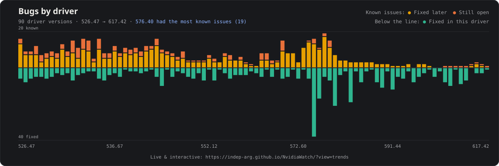

# NvidiaWatch

**Live:** [indep-arg.github.io/NvidiaWatch](https://indep-arg.github.io/NvidiaWatch/)

I built this simple tracker to log bugs found in NVIDIA drivers (Game Ready & Studio) and create a searchable database of known issues, whether they're fixed, pending, or simply forgotten. Yes, sometimes bugs just disappear in the next driver release with no explanation: was it actually fixed? Was it an external issue? Does it still exist? No one knows.

This database can help in several ways. For example, we can analyze which driver branches were hit hardest by bugs and which were the most stable. All data is sourced from official NVIDIA release notes.

## Bug trends



Above the line are the known issues each driver shipped with:

- **Fixed later:** fixed in a later driver, or outside the driver (game patch, OTA profile update).
- **Pending:** not fixed yet.

Below the line are the bugs that driver fixed.

## Features

- Search across games, driver versions, known issues and NVIDIA bug IDs
- Filter by status (pending or fixed)
- Sort by driver version or number of bugs
- Release date, channel (Game Ready / Studio) and release notes link for every driver
- Masonry and timeline views, light and dark theme
- Quick overview: drivers tracked, issues logged, fix rate and how many are still pending

## How it's built

Plain HTML, CSS and JavaScript on GitHub Pages, with no framework and no build step. Icons are from [Ionicons](https://ionic.io/ionicons) and embedded in the page, fonts come from Google Fonts.

```
docs/
├── index.html
├── style.css
├── lib.js                   # data helpers (filtering, stats, chart series)
├── script.js                # page logic
├── drivers.json             # driver and bug data
└── assets/
    └── bugs-chart-dark.svg  # generated by scripts/generate_chart.py
scripts/
├── validate_data.py         # checks drivers.json
└── generate_chart.py        # draws the README chart
tests/
```

To run the checks locally:

```
python -m unittest discover -s tests
node --test tests/lib.test.js
python scripts/validate_data.py
```

## Contributing

Found a bug in a driver, or know of an issue that's missing? Open an issue or a PR. See [CONTRIBUTING.md](CONTRIBUTING.md) for the data format.

## License

The code is MIT licensed, see [LICENSE](LICENSE). The data in `docs/drivers.json` is licensed under CC BY 4.0, see [LICENSE-DATA.md](LICENSE-DATA.md). Third-party notices are in [THIRD_PARTY_NOTICES.md](THIRD_PARTY_NOTICES.md).

## Credit

Built by [indep-arg](https://github.com/indep-arg) for the community.
